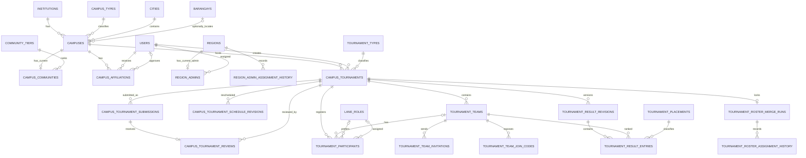

# Campus and Tournament Database

Last updated: 2026-08-07

This document describes the normalized campus and campus-tournament database
implemented in MSLv2026.

The legacy production database is reference material only. These tables belong
to the new website and do not migrate or modify legacy production data.

## Implemented scope

The implemented database includes:

- `campus_types`
- `institutions`
- `campuses`
- `community_tiers`
- `campus_communities`
- `campus_affiliations`
- tournament reference tables
- regional-administrator assignments and history
- campus tournaments, reviews, and schedule history
- immutable campus-tournament submission history
- teams, participants, invitations, and join codes
- solo-roster merge runs and assignment history
- revisioned tournament results

It also uses the existing `users`, `cities`, and `barangays` tables.

## Current implementation status

The normalized tournament schema is implemented and applied to the configured
MySQL `mslv2026` database through these migrations:

| Migration | Tables or changes |
|---|---|
| `2026_07_30_000005_create_tournament_reference_and_region_admin_tables` | Tournament lookup tables, current Regional Admin assignments, and assignment history |
| `2026_07_30_000006_create_campus_tournament_tables` | Tournaments, review history, and schedule revision history |
| `2026_07_30_000007_create_tournament_roster_tables` | Teams, participants, invitations, join codes, merge runs, and assignment history |
| `2026_07_30_000008_create_tournament_result_tables` | Result revisions, result entries, and the current-result pointer |
| `2026_08_07_000001_add_campus_tournament_submission_history` | Immutable request submissions, current-submission pointer, and review-to-submission linkage |

Verification on 2026-07-30 confirmed:

- all migrations are recorded as applied;
- `tournament_types` contains 2 seeded records;
- `lane_roles` contains 5 seeded records;
- `tournament_placements` contains 5 seeded records;
- operational Regional Admin and tournament tables contain no invented sample
  records.

The Student Leader creation/resubmission/cancellation and Regional Admin
approval/rejection backend is implemented with authenticated web actions,
policies, validation, transactions, immutable submission snapshots, and tests.
Tournament user interfaces, team workflows, scheduled merging, result services,
rescheduling, notifications, and exports have not been added.

## Entity relationships



Relationship summary:

- An institution can have multiple campuses.
- Every campus has one campus type and one required city.
- A campus may reference a barangay and street address.
- A campus can have at most one current MSL community.
- Every campus community has one community tier.
- A user may be affiliated with multiple campuses.
- A campus may have multiple affiliated users.
- An affiliation may be approved by another user.
- A campus derives its official region through its required city.
- Each official region has at most one current Regional Admin.
- A campus tournament has separate registration and event periods.
- A tournament has immutable numbered submissions and points to its current
  submission.
- Every new review identifies the exact submission that was reviewed.
- A user has at most one participant record per tournament.
- A team has at most one player assigned to each fixed lane role.
- A tournament has at most one roster-merge run.
- Tournament results are represented as revisions, and a tournament can point
  to its current revision.

## Tables

### `campus_types`

Classifies a campus using the categories carried forward from the verified
legacy reference data.

| Column | Type | Rules |
|---|---|---|
| `id` | BIGINT UNSIGNED | Primary key |
| `name` | VARCHAR(100) | Required, unique |
| `code` | VARCHAR(50) | Required, unique |
| `created_at` | TIMESTAMP | Laravel timestamp |
| `updated_at` | TIMESTAMP | Laravel timestamp |

Seeded values:

| Name | Code |
|---|---|
| Private | `private` |
| SUC Main | `suc_main` |
| SUC Satellite | `suc_satellite` |
| LUC | `luc` |
| OGS | `ogs` |

### `institutions`

Stores a parent educational institution independently from its branches or
campuses.

| Column | Type | Rules |
|---|---|---|
| `id` | BIGINT UNSIGNED | Primary key |
| `name` | VARCHAR(255) | Required, unique |
| `acronym` | VARCHAR(50) | Nullable |
| `status` | VARCHAR(20) | Defaults to `active`, indexed |
| `created_at` | TIMESTAMP | Laravel timestamp |
| `updated_at` | TIMESTAMP | Laravel timestamp |

Current status convention:

- `active`
- `inactive`

The database currently seeds National University as the initial verified parent
institution. More institutions must only be added after their parent/campus
names have been reviewed.

### `campuses`

Stores a physical or organizational campus belonging to a parent institution.
Campus names should not repeat the complete institution name.

Example:

```text
Institution: National University
Campus: Fairview
```

| Column | Type | Rules |
|---|---|---|
| `id` | BIGINT UNSIGNED | Primary key |
| `institution_id` | BIGINT UNSIGNED | FK to `institutions.id` |
| `campus_type_id` | BIGINT UNSIGNED | FK to `campus_types.id` |
| `name` | VARCHAR(255) | Required |
| `city_code` | VARCHAR(255) | FK to `cities.code` |
| `barangay_code` | VARCHAR(255) | Nullable FK to `barangays.code` |
| `address_line` | VARCHAR(255) | Nullable |
| `status` | VARCHAR(20) | Defaults to `active`, indexed |
| `created_at` | TIMESTAMP | Laravel timestamp |
| `updated_at` | TIMESTAMP | Laravel timestamp |

Constraints:

- `UNIQUE (institution_id, name)`
- Deleting a referenced institution, campus type, or city is restricted.
- Deleting a referenced barangay sets `barangay_code` to `NULL`.

Province, region, and island are not duplicated on this table. They are
retrieved through the existing geographic hierarchy.

The database does not currently verify that the selected barangay belongs to the
selected city. Request validation must enforce that rule.

### `community_tiers`

Defines the ordered MSL community accreditation tiers.

| Column | Type | Rules |
|---|---|---|
| `id` | BIGINT UNSIGNED | Primary key |
| `name` | VARCHAR(100) | Required, unique |
| `code` | VARCHAR(50) | Required, unique |
| `rank` | TINYINT UNSIGNED | Required, unique |
| `created_at` | TIMESTAMP | Laravel timestamp |
| `updated_at` | TIMESTAMP | Laravel timestamp |

Seeded values:

| Rank | Name | Code |
|---:|---|---|
| 1 | Tier C | `tier_c` |
| 2 | Tier B | `tier_b` |
| 3 | Tier A | `tier_a` |
| 4 | Super School | `super_school` |

### `campus_communities`

Stores the current MSL community associated with a campus.

| Column | Type | Rules |
|---|---|---|
| `id` | BIGINT UNSIGNED | Primary key |
| `campus_id` | BIGINT UNSIGNED | Required, unique FK to `campuses.id` |
| `name` | VARCHAR(255) | Required |
| `acronym` | VARCHAR(50) | Nullable |
| `community_tier_id` | BIGINT UNSIGNED | FK to `community_tiers.id` |
| `status` | VARCHAR(20) | Defaults to `pending`, indexed |
| `accredited_at` | TIMESTAMP | Nullable |
| `created_at` | TIMESTAMP | Laravel timestamp |
| `updated_at` | TIMESTAMP | Laravel timestamp |

Current status convention:

- `pending`
- `active`
- `suspended`
- `inactive`

The unique constraint on `campus_id` enforces at most one current community per
campus. Campus and community-tier deletion is restricted while referenced.

### `campus_affiliations`

Connects users to campuses and is the authoritative source for determining
whether a user is a Student Leader for a particular campus.

| Column | Type | Rules |
|---|---|---|
| `id` | BIGINT UNSIGNED | Primary key |
| `campus_id` | BIGINT UNSIGNED | FK to `campuses.id` |
| `user_id` | BIGINT UNSIGNED | FK to `users.id` |
| `role` | VARCHAR(30) | Defaults to `member` |
| `status` | VARCHAR(20) | Defaults to `pending` |
| `started_at` | TIMESTAMP | Nullable |
| `ended_at` | TIMESTAMP | Nullable |
| `approved_by_user_id` | BIGINT UNSIGNED | Nullable FK to `users.id` |
| `approved_at` | TIMESTAMP | Nullable |
| `created_at` | TIMESTAMP | Laravel timestamp |
| `updated_at` | TIMESTAMP | Laravel timestamp |

Constraints and indexes:

- `UNIQUE (campus_id, user_id)`
- Index on `(campus_id, role, status)`
- Index on `(user_id, status)`
- Campus and affiliated-user deletion is restricted.
- Deleting the approving user sets `approved_by_user_id` to `NULL`.

Current role convention:

- `member`
- `student_leader`

Current status convention:

- `pending`
- `active`
- `rejected`
- `revoked`
- `expired`

A user is authorized as a campus Student Leader only when an affiliation for
that campus has:

```text
role = student_leader
status = active
```

The legacy `users.university` and `users.user_type` text fields must not
authorize campus actions.

## Tournament reference tables

Three lookup tables hold stable, displayable tournament values:

| Table | Seeded codes |
|---|---|
| `tournament_types` | `online`, `onsite` |
| `lane_roles` | `jungler`, `roam`, `gold_laner`, `exp_laner`, `mid_laner` |
| `tournament_placements` | `1st`, `2nd`, `3rd`, `4th`, `participant` |

Each table uses a string `code` primary key, unique display name, unique
`sort_order`, and Laravel timestamps. These records are referenced rather than
repeated as free text.

## Regional administration

### `region_admins`

Stores only the authoritative current Regional Admin for an official region.
`region_code` is both the primary key and a foreign key to `regions.code`, which
enforces at most one current administrator per region.

The table also stores `user_id`, optional `assigned_by_user_id`, `assigned_at`,
and Laravel timestamps. User and region deletion is restricted.

A campus does not duplicate a region foreign key. Its review region is:

```text
campuses.city_code -> cities.code -> cities.region_code -> regions.code
```

### `region_admin_assignment_history`

Retains every regional assignment using `region_code`, `user_id`,
`assigned_by_user_id`, `started_at`, and nullable `ended_at`. Replacing the
current row in `region_admins` must also close the previous history row and
create the new one in the same transaction.

## Campus tournaments

### `campus_tournaments`

Stores:

- hosting `campus_id` and `created_by_user_id`
- tournament `name` and normalized `tournament_type_code`
- approval status: `pending`, `approved`, `rejected`, or `cancelled`
- nullable `current_submission_id` pointing to the latest submitted version
- `registration_opens_at` and `registration_closes_at`
- event `starts_at` and `ends_at`
- nullable `roster_locked_at`
- nullable cancellation actor, reason, and timestamp
- nullable `current_result_revision_id`

The tournament does not store `school_name`, `sl_name`, region, or other
duplicated descriptive fields. Those values are obtained through relationships.

### `campus_tournament_submissions`

Stores an immutable snapshot for every initial submission and resubmission:

- tournament, submitter, and per-tournament version number
- campus, tournament name, and normalized tournament type
- registration and event timestamps exactly as submitted
- nullable resubmission reason, required by the application after version 1
- submission timestamp

`UNIQUE (tournament_id, version)` prevents duplicate version numbers. The
Eloquent model rejects updates and deletes. Existing tournaments are backfilled
as version 1 when the migration is applied.

The application must derive operational state:

| Condition | Derived state |
|---|---|
| Not approved | approval status |
| Approved, before registration opens | Scheduled |
| Registration window active | Registration open |
| Registration closed, before event starts | Registration closed |
| Event window active | Ongoing |
| Event has ended | Completed |

### Reviews and schedule revisions

`campus_tournament_reviews` records every approving or rejecting reviewer,
decision, optional reason, and timestamp. New rows reference a unique
`submission_id`, preventing the same submission from being reviewed twice.
The foreign key remains nullable only so pre-implementation review data can be
retained when its exact historic submission cannot be reconstructed.

`campus_tournament_schedule_revisions` records the previous and replacement
registration/event timestamps, changing user, reason, and timestamp. Current
dates remain on `campus_tournaments` for efficient queries.

## Rosters

### `tournament_teams`

Stores a tournament-scoped team with:

- `name` plus nullable `active_name`
- formation method `premade` or `solo`
- status `assembling`, `registered`, `merged`, `withdrawn`, or
  `not_qualified`
- required captain user
- optional Discord ID
- registration, merge, and withdrawal timestamps

`UNIQUE (tournament_id, active_name)` prevents duplicate names among active
teams while permitting historical inactive rows to set `active_name` to
`NULL`.

### `tournament_participants`

Provides the canonical user registration for a tournament. It stores the
current optional team, `premade`/`solo` entry method, captain/member roster
role, preferred and assigned lane roles, participation status, and relevant
timestamps.

Important constraints:

- `UNIQUE (tournament_id, user_id)` prevents a user joining multiple teams in
  the same tournament.
- `UNIQUE (team_id, assigned_lane_role_code)` permits at most one assigned
  player per lane.
- Historical user, tournament, and team deletion is restricted.

Participant statuses are `pending`, `active`, `declined`, `withdrawn`, and
`not_qualified`.

### Invitations and join codes

`tournament_team_invitations` retains every invitation and response. Its states
are `pending`, `accepted`, `declined`, `cancelled`, and `expired`.

`tournament_team_join_codes` stores only a unique SHA-256 `code_hash`, an
optional non-secret hint, expiration, revocation timestamp, creator, and team.
Plain-text join codes must never be stored.

## Automatic solo-roster merging

`tournament_roster_merge_runs` has a unique `tournament_id`, making roster
merge-run creation idempotent at the database level. It stores run state and
summary counts. The application must still make the complete merge transaction
safe to retry.

`tournament_roster_assignment_history` records each pooled participant's source
team, final team, preferred/previous/final role, FCFS ordering position, and
outcome.

The future application transaction must:

1. Preserve complete five-player solo teams.
2. Pool active players from incomplete solo teams ordered by `registered_at`,
   then participant ID.
3. Form consecutive groups of exactly five.
4. Make the earliest player captain and retain that player's source team name,
   adding a deterministic suffix only when required for uniqueness.
5. Randomly assign exactly one of each seeded lane role.
6. Mark a remainder smaller than five as `not_qualified`.
7. Persist the merge run and assignment history before setting
   `roster_locked_at`.

## Revisioned results

`tournament_result_revisions` stores a version number, submitter, reason, and
submission timestamp. `UNIQUE (tournament_id, version)` preserves revision
ordering. The schema supports revision history, but the application must
prohibit updates and deletes that would violate immutability.

`tournament_result_entries` stores one row per team and revision, its placement,
team-name snapshot, and JSON roster snapshot. Placement is intentionally not
unique because the workflow permits ties.

`campus_tournaments.current_result_revision_id` identifies the published
revision. The initial revision may have no reason; later corrections must
provide one. That conditional rule requires application validation.

## Existing Eloquent models and relationships

| Model | Relationships |
|---|---|
| `Institution` | `hasMany(Campus)` |
| `CampusType` | `hasMany(Campus)` |
| `Campus` | belongs to institution, campus type, city, and optional barangay; has one community; has many affiliations |
| `CommunityTier` | `hasMany(CampusCommunity)` |
| `CampusCommunity` | belongs to campus and community tier |
| `CampusAffiliation` | belongs to campus, user, and optional approving user |
| `User` | has many campus affiliations and approved campus affiliations |
| `City` | has many campuses |
| `Barangay` | has many campuses |
| `CampusTournament` | belongs to campus, creator, type, and current submission; has many submissions, reviews, and schedule revisions |
| `CampusTournamentSubmission` | belongs to tournament, submitter, campus, and type; has one review |
| `CampusTournamentReview` | belongs to tournament, submission, and reviewer |
| `RegionAdmin` | belongs to its official region, assigned user, and assigning user |

Date casts currently implemented:

- `CampusCommunity.accredited_at`
- `CampusAffiliation.started_at`
- `CampusAffiliation.ended_at`
- `CampusAffiliation.approved_at`

Tournament creation and approval timestamps are cast to datetimes. Incoming
web-action timestamps are interpreted as `Asia/Manila`, converted to UTC, and
stored through a UTC MySQL/MariaDB session (`DB_TIMEZONE=+00:00` by default).

## Creation and approval behavior

Authenticated Inertia-compatible web actions support creation, resubmission,
approval, rejection, and audited cancellation. They return redirects with
Laravel validation errors or status flash messages; the tournament UI remains
deferred.

- Creation requires an active campus and an active `student_leader`
  affiliation for the selected campus.
- Registration and event dates must satisfy
  `registration_open < registration_close <= event_start < event_end`.
- A campus cannot have overlapping pending or approved tournaments. Touching
  boundaries are allowed.
- Only the original creator may resubmit a rejected request or cancel a pending
  request, and both actions require reasons.
- Review authority comes from the current `region_admins` row for the region
  reached through `campus -> city -> region`. An active Super Admin is the only
  override.
- The `pendingForReviewer` query scope applies the same official-region rule
  when loading a Regional Admin's pending queue.
- Rejection requires a reason; approval notes are optional.
- Approval rechecks campus state, creator affiliation, and schedule conflicts.
- Mutations use transactions and row locks. Status conflicts return HTTP 409.

Operational lifecycle is derived with half-open boundaries: `scheduled`,
`registration_open`, `registration_closed`, `ongoing`, and `completed`.
Approval remains a separate stored state.

## Database-enforced tournament rules

The implemented tournament schema currently enforces:

- one current Regional Admin row per official region;
- foreign-key references to official regions, campuses, users, teams, lookup
  values, revisions, and history records;
- restrictive deletion for tournament and administrative history;
- tournament approval values: `pending`, `approved`, `rejected`, `cancelled`;
- review decisions: `approved`, `rejected`;
- one submission version per `(tournament_id, version)`;
- at most one review for each non-null submission reference;
- team formation methods: `premade`, `solo`;
- team statuses: `assembling`, `registered`, `merged`, `withdrawn`,
  `not_qualified`;
- participant entry methods, roster roles, and participation statuses;
- invitation, merge-run, and merge-outcome values;
- one participant record per `(tournament_id, user_id)`;
- one non-null assigned lane role per team;
- one active team name per tournament when `active_name` is populated;
- one merge run per tournament;
- one merge-history row per participant and merge run;
- one result revision version per tournament;
- one result entry per team and revision;
- seeded foreign-key values for tournament type, lane role, and placement.

MySQL does not provide partial unique indexes in this design. Consequently,
`active_name` must be set to `NULL` when a team becomes inactive so its name can
be reused.

## Migration order

The tables are created in this dependency order:

1. Campus foundation tables
2. Tournament reference tables
3. `region_admins` and `region_admin_assignment_history`
4. `campus_tournaments`, reviews, and schedule revisions
5. Teams, participants, invitations, join codes, and merge history
6. Result revisions and entries
7. The current-result foreign key on `campus_tournaments`
8. Tournament submission history, current-submission pointer, and review link

The existing `users`, `cities`, and `barangays` migrations must run before the
campus migrations.

## Seeders

`DatabaseSeeder` invokes:

1. `CampusTypeSeeder`
2. `InstitutionSeeder`
3. `CampusSeeder`
4. `CommunityTierSeeder`
5. `CampusCommunitySeeder`
6. `CampusAffiliationSeeder`
7. `TournamentReferenceSeeder`
8. `CampusTournamentSeeder`

`CampusSeeder`, `CampusCommunitySeeder`, and `CampusAffiliationSeeder` are
intentionally empty. `CampusTournamentSeeder` is a development-only unified
fixture that creates the LSPU institution and Los Baños Campus, an active
CALABARZON Regional Admin assignment with history, and an active Student Leader
affiliation. It does not create a tournament, allowing the creation workflow to
be tested through Postman or the application. It refuses to run in production.

Run the unified development fixture with:

```bash
php artisan db:seed --class=CampusTournamentSeeder
```

Development logins:

| Role | Username | Password |
|---|---|---|
| Regional Admin | `lspu_regional_admin` | `password` |
| Student Leader | `lspu_student_leader` | `password` |

The current `DatabaseSeeder` also creates `test@example.com`. Do not run the
default seeder in a production environment.

For schema only:

```bash
php artisan migrate
```

For fixed reference data without creating operational records:

```bash
php artisan db:seed --class=CampusTypeSeeder
php artisan db:seed --class=CommunityTierSeeder
php artisan db:seed --class=TournamentReferenceSeeder
```

Run the institution seeder only after reviewing its contents:

```bash
php artisan db:seed --class=InstitutionSeeder
```

## Current enforcement boundaries

The following rules are not fully enforced by the database and require later
Laravel validation, policies, or transactional services:

- Allowed string status and role values on the campus-foundation tables
- Barangay must belong to the selected city
- Affiliation end time must not precede its start time
- Approval metadata must match the affiliation status
- Only active Student Leaders may manage their affiliated campuses
- Campus community status and accreditation timestamp consistency
- Registration open must precede registration close.
- Registration close must not be after the event starts.
- Event start must precede event end.
- Tournament creators must be active Student Leaders for the host campus.
- Tournament reviewers must be the current administrator for the campus's
  derived official region.
- Participants must have an active affiliation with the host campus.
- A participant's `team_id` must belong to the same tournament as the
  participant.
- A team's `captain_user_id` must identify its active captain participant.
- Invitation and join-code actions must occur before roster lock.
- Registered teams must have exactly five active participants and one captain.
- Inactive participants must not retain an assigned lane role that blocks an
  active player through the team/role unique constraint.
- Only one invitation may be pending for a user/team at a time.
- Only one active join code may exist for a team.
- Solo merging must run transactionally and lock relevant tournament,
  participant, and team rows.
- Result corrections after version 1 require a reason.
- A current result revision must belong to the same tournament.
- A result entry's revision and team must belong to the same tournament.
- Result-revision and result-entry rows must be treated as immutable after
  submission.

These application rules must be implemented before exposing campus-management
write operations.
